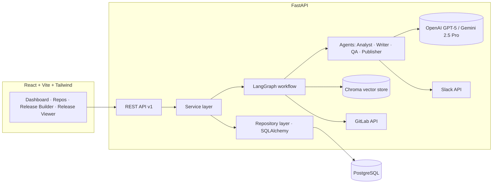
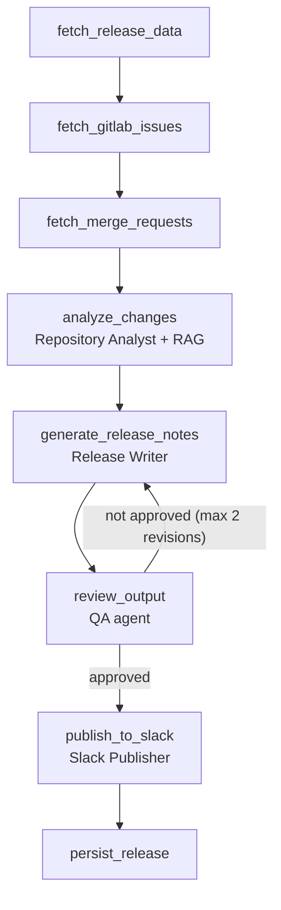

# AI Release Manager

AI-powered release management platform. Connects to GitLab repositories, analyzes commits, merge requests and issues with a multi-agent LangGraph workflow, generates release notes in four formats with an LLM (OpenAI or Google Gemini), validates them with a QA agent that enforces traceability, and publishes the result to Slack.

Built as a production-style internal tool: FastAPI + SQLAlchemy + PostgreSQL backend, React + TypeScript + Tailwind frontend, Docker Compose deployment.

## Features

- **GitLab integration** — connect any GitLab project with a personal access token (encrypted at rest). Select a release range by tag pair (`v1.0.0 → v1.1.0`), last N days, or since a date.
- **Multi-agent LangGraph workflow** — four agents orchestrated as a graph with retries, error handling and a QA revision loop.
- **AI analysis** — every change is classified (Features, Bug Fixes, Performance, Security, Refactoring, Infrastructure, Documentation) with business impact, technical impact and risk level (low/medium/high).
- **Four output formats** — executive (managers), technical (engineers), publish-ready markdown, and Slack-optimized mrkdwn.
- **RAG layer** — commits, MRs, issues and previous release notes are embedded into a per-repository Chroma vector store; relevant historical context is retrieved before generation so notes match past tone and conventions.
- **Slack publishing** — Block Kit message with risk indicator, full notes as a thread reply, permalink returned and stored. Auto-publish from the workflow or manual publish from the UI.
- **Issue board** — GitLab-style board per repository with live issues in Open and Closed columns, plus configurable label lists (open issues with a listed label move into their own column, like GitLab boards). Cards can be dragged between columns — closing/reopening issues and adding/removing labels directly in GitLab — and new issues can be created from the board.
- **Metrics dashboard** — releases per week, category breakdown, generation times, commits/issues analyzed, estimated documentation hours saved.
- **Security** — JWT auth, Fernet-encrypted third-party tokens, rate limiting, strict input validation, structured audit logging.

## Architecture



### Release generation workflow (LangGraph)



Every external-call node retries with exponential backoff (tenacity); any terminal failure marks the release `failed` with the error recorded in a `GenerationLog` audit row, including per-node timings.

### Agents

| Agent | Responsibility |
| --- | --- |
| **Repository Analyst** | Groups related commits/MRs/issues into logical changes, detects themes, classifies category + impacts + risk. Every change must cite `source_refs`. |
| **Release Writer** | Produces the four note formats from the structured analysis, matching the tone of previous releases retrieved via RAG. |
| **QA** | Validates notes against the source data digest: traceability score, hallucination detection, format checks. Rejections loop back to the writer with actionable feedback. |
| **Slack Publisher** | Builds the Block Kit message (header, risk context, notes, link), publishes, posts full markdown as a thread reply, returns the permalink. |

All LLM calls use `with_structured_output` against Pydantic schemas — downstream code never parses free text. The provider is swappable via `AI_PROVIDER=openai|gemini` (or per-request override).

## Tech stack

**Backend:** Python 3.12+, FastAPI, LangGraph, LangChain, SQLAlchemy 2.0, Pydantic v2, PostgreSQL, python-gitlab, slack-sdk, Chroma, structlog, slowapi
**Frontend:** React 18, Vite, TypeScript (strict), Tailwind CSS, shadcn/ui-style components, TanStack Query, Recharts
**Infra:** Docker, Docker Compose, environment-based config, structured JSON logging

## Quick start

```bash
cp .env.example .env
# Fill in: JWT_SECRET_KEY, ENCRYPTION_KEY, OPENAI_API_KEY (or GEMINI_API_KEY + AI_PROVIDER=gemini)

docker compose up --build
```

- Frontend: http://localhost:5173
- API docs (Swagger): http://localhost:8000/docs

Then in the UI: register → connect a GitLab repository (URL + project path + access token) → optionally connect Slack (bot token with `chat:write` scope + default channel) → generate a release.

### Local development

```bash
# Backend (requires a local PostgreSQL or docker compose up db)
cd backend
python3.12 -m venv .venv && source .venv/bin/activate
pip install -e ".[dev]"
uvicorn app.main:app --reload

# Frontend
cd frontend
npm install
npm run dev
```

### Tests

```bash
cd backend && .venv/bin/python -m pytest        # 46 unit + integration tests
cd frontend && npm run build                    # strict TS compile + production build
```

The test suite runs against SQLite with fake GitLab/Slack/LLM boundaries — including an end-to-end LangGraph workflow test that exercises the QA revision loop and Slack auto-publication.

## API

| Method | Endpoint | Description |
| --- | --- | --- |
| POST | `/api/v1/auth/register` · `/login` | JWT auth |
| GET | `/api/v1/auth/me` | Current user |
| POST | `/api/v1/repositories/connect` | Validate token against GitLab and connect a project |
| GET | `/api/v1/repositories` · `/{id}` | List / detail with recent releases |
| GET | `/api/v1/repositories/{id}/board` | Issue board: live GitLab issues in Open / label lists / Closed columns |
| POST | `/api/v1/repositories/{id}/board/lists` | Add a board list for a project label |
| DELETE | `/api/v1/repositories/{id}/board/lists/{list_id}` | Remove a board list |
| POST | `/api/v1/repositories/{id}/board/issues` | Create an issue in the GitLab project |
| POST | `/api/v1/repositories/{id}/board/issues/{iid}/move` | Move an issue between board columns (close/reopen, add/remove labels) |
| POST | `/api/v1/releases/generate` | Create release + run the workflow in background (202) |
| GET | `/api/v1/releases` · `/{id}` | Paginated list / full detail (notes, QA report, sources) |
| POST | `/api/v1/slack/connect` | Verify and store a Slack bot token |
| POST | `/api/v1/slack/publish` | Publish a completed release to a channel |
| GET | `/api/v1/metrics` | Dashboard aggregates |

## Project structure

```
backend/
  app/
    api/            # routes + dependencies (auth, rate limits)
    core/           # config, security (JWT/Fernet), logging, rate limiting
    db/             # engine, sessions, init
    models/         # User, Repository, Release, Commit, Issue, MergeRequest,
                    # SlackWorkspace, GenerationLog, BoardList
    schemas/        # Pydantic request/response contracts
    repositories/   # repository pattern over SQLAlchemy
    services/       # service layer (auth, repos, releases, slack, metrics)
    integrations/   # GitLab + Slack clients (typed wrappers)
    ai/
      provider.py   # OpenAI/Gemini factory (chat + embeddings)
      schemas.py    # structured-output contracts
      agents/       # analyst, writer, qa, publisher
      rag/          # per-repo Chroma knowledge base
    workflows/      # LangGraph state, nodes, graph, background runner
  tests/            # unit + integration (fakes for all external boundaries)
frontend/
  src/              # pages, hooks, typed API client, ui components
docs/               # mockups & architecture notes
```

## Security model

- **JWT authentication** on every endpoint except register/login/health; per-user data isolation enforced at the query level.
- **Token encryption** — GitLab and Slack tokens are Fernet-encrypted before persistence and only decrypted in memory at call time. They are never returned by the API.
- **Rate limiting** — global default plus stricter limits on login and release generation.
- **Audit logging** — security-relevant events (logins, connections, publications) are emitted through a dedicated structured audit logger; every workflow run is recorded in `generation_logs` with timings and errors.

## Screens

See [docs/mockups](docs/mockups/) for example mockups: dashboard with metrics charts, repository page, release builder (range + AI config), and release viewer (notes tabs, QA report, source data, Slack publication status).
